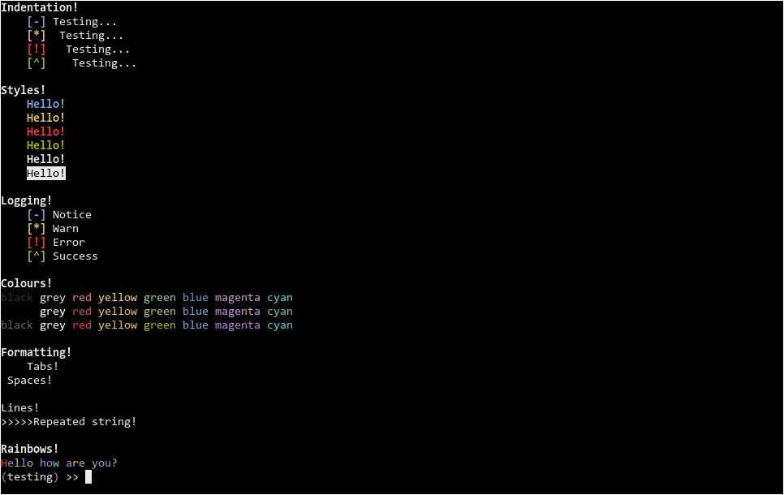

# module

A simple header for making the task of piping data between processes easier.



## Examples

#### 1. Processing streamed data

```cpp
#include <iostream>
#include "module.h"


int main(int argc, char const *argv[]) {
    // Stream input data and process it in chunks.
    
    wlg::receive([&] (const std::string& buffer, int id, bool is_end) {
        // Pass the data along through the pipe.
        wlg::piper << buffer;
    });


    return 0;
}
```

#### 2. Processing accumulated data

```cpp
#include <iostream>
#include "module.h"


int main(int argc, char const *argv[]) {
    // Accumulate all input data.
    auto contents = wlg::receive_all();

    // Pipe the contents.
    wlg::piper << contents;

    return 0;
}
```

#### 3. Logging & IO

```cpp
#include <iostream>
#include "module.h"


int main(int argc, char const *argv[]) {

    wlg::print("Hello", " ", "there!", "\n");
    wlg::println("Hello", " ", "there!");

    wlg::pipe("Pipe ", 1, "\n");
    wlg::pipeln("Pipe ", 2);

    wlg::notice("Notice ", 1, "\n");
    wlg::noticeln("Notice ", 2);

    wlg::warn("Warn ", 1, "\n");
    wlg::warnln("Warn ", 2);

    wlg::error("Error ", 1, "\n");
    wlg::errorln("Error ", 2);

    wlg::success("Success ", 1, "\n");
    wlg::successln("Success ", 2);

    wlg::print("Yes!") << " " << "No!" << std::endl;

    wlg::printer << "Printer\n";
    wlg::piper << "Piper\n";

    return 0;
}
```

#### 4. Colours & Styles!

```cpp
#include <iostream>
#include "../module.h"


int main(int argc, char const *argv[]) {
    // Indentation.
    wlg::println(wlg::style::bold, "Indentation!");

    wlg::print(wlg::tabs(1));
    wlg::noticeln(wlg::spaces(0), "Testing...");

    wlg::print(wlg::tabs(1));
    wlg::warnln(wlg::spaces(1),   "Testing...");

    wlg::print(wlg::tabs(1));
    wlg::errorln(wlg::spaces(2),  "Testing...");

    wlg::print(wlg::tabs(1));
    wlg::successln(wlg::spaces(3),  "Testing...");


    // Styles.
    wlg::println(wlg::style::bold, "\nStyles!");

    wlg::println(
        wlg::tabs(1),
        wlg::style::notice,
        "Hello!"
    );

    wlg::println(
        wlg::tabs(1),
        wlg::style::warn,
        "Hello!"
    );

    wlg::println(
        wlg::tabs(1),
        wlg::style::error,
        "Hello!"
    );

    wlg::println(
        wlg::tabs(1),
        wlg::style::success,
        "Hello!"
    );

    wlg::println(
        wlg::tabs(1),
        wlg::style::bold,
        "Hello!"
    );

    wlg::println(
        wlg::tabs(1),
        wlg::style::reverse,
        "Hello!"
    );


    // Logging.
    wlg::println(wlg::style::bold, "\nLogging!");

    wlg::print(wlg::tabs(1));
    wlg::noticeln("Notice");

    wlg::print(wlg::tabs(1));
    wlg::warnln("Warn ");

    wlg::print(wlg::tabs(1));
    wlg::errorln("Error ");

    wlg::print(wlg::tabs(1));
    wlg::successln("Success ");


    // Colours.
    wlg::println(wlg::style::bold, "\nColours!");

    wlg::println(
        wlg::colour::fg::dim::black,   "black",   " ",
        wlg::colour::fg::dim::grey,    "grey",    " ",
        wlg::colour::fg::dim::red,     "red",     " ",
        wlg::colour::fg::dim::yellow,  "yellow",  " ",
        wlg::colour::fg::dim::green,   "green",   " ",
        wlg::colour::fg::dim::blue,    "blue",    " ",
        wlg::colour::fg::dim::magenta, "magenta", " ",
        wlg::colour::fg::dim::cyan,    "cyan",    " "
    );

    wlg::println(
        wlg::colour::fg::black,   "black",   " ",
        wlg::colour::fg::grey,    "grey",    " ",
        wlg::colour::fg::red,     "red",     " ",
        wlg::colour::fg::yellow,  "yellow",  " ",
        wlg::colour::fg::green,   "green",   " ",
        wlg::colour::fg::blue,    "blue",    " ",
        wlg::colour::fg::magenta, "magenta", " ",
        wlg::colour::fg::cyan,    "cyan",    " "
    );

    wlg::println(
        wlg::colour::fg::bright::black,   "black",   " ",
        wlg::colour::fg::bright::grey,    "grey",    " ",
        wlg::colour::fg::bright::red,     "red",     " ",
        wlg::colour::fg::bright::yellow,  "yellow",  " ",
        wlg::colour::fg::bright::green,   "green",   " ",
        wlg::colour::fg::bright::blue,    "blue",    " ",
        wlg::colour::fg::bright::magenta, "magenta", " ",
        wlg::colour::fg::bright::cyan,    "cyan",    " "
    );


    // Lines, Tabs and Spaces.
    wlg::println(wlg::style::bold, "\nFormatting!");
    wlg::println(wlg::tabs(1), "Tabs!");
    wlg::println(wlg::spaces(1), "Spaces!");
    wlg::println(wlg::lines(1), "Lines!");
    wlg::println(wlg::repeat(">", 5), "Repeated string!");


    // Rainbows.
    wlg::println(wlg::style::bold, "\nRainbows!");
    wlg::rainbowln("Hello ", "how ", "are ", "you?");

    return 0;
}
```

## Run

> Note: This works with `bash` but should also work with other shells that support the same functionality.

`echo "Hello World!" | ./reciever.out`

`cat <filename> | ./reciever.out`

`./reciever.out < <filename>`

`cat <filename> | ./reciever.out | ./reciever.out`

## Interface

> Note: anything defined within the "details" namespace is used internally and should not be used directly by the user.

#### Constants & Globals

| Styles  | wlg::style::                             |
| ------- | ----------------------------------------------- |
| bold    | Makes the text bold.                            |
| reverse | Swaps the background and foreground colours.    |
| reset   | Reset the style so the text appears normal.     |
| notice  | Set the text to bold and use the notice colour. |
| warn    | Set the text to bold and use the warn colour.   |
| error   | Set the text to bold and use the error colour.  |

| Streams | wlg::                       |
| :------ | ---------------------------------- |
| printer | Alias the std::cerr output steam.  |
| piper   | Alias the std::cout output stream. |

| Colours | wlg::colour::                                     |
| ------- | -------------------------------------------------------- |
| black   | Looks like coal.                                         |
| red     | Same colour as the liquid being pumped around your body. |
| green   | That furry stuff that grows in your garden colour.       |
| yellow  | The Sun. (don't stare at it)                             |
| blue    | The Ocean or The Sky depending on shade.                 |
| magenta | Some flowers look like this.                             |
| cyan    | Also flowers.                                            |
| grey    | All fifty shades of it.                                  |

> All of the above colours exist in `fg::`, `bg::`, `fg::bright::`, `bg::bright::`, `fg::dim::` and `bg::dim::`.

| Special Colours | wlg::colour::        |
| --------------- | --------------------------- |
| notice          | Colour to use for notices.  |
| warn            | Colour to use for warnings. |
| error           | Colour to use for errors.   |
| success         | Colour to use for success.  |

#### Functions.

| Data Handling | wlg::                                                 |
| ------------- | ------------------------------------------------------------ |
| receive       | Recieve data on std::cin in chunks using a callback. |
| receive_all   | Accumulate all the data from std::cin and return a std::string. |

| Logging | wlg::                                                                          |
| ------- | ------------------------------------------------------------------------------------- |
| print   | Prints a list of objects to wlg::printer and appends wlg::style::reset. |
| pipe    | Same as print but outputs to wlg::piper.                                       |
| notice  | Same as print but prepends message with `[-]` and uses wlg::style::notice.     |
| warn    | Same as print but prepends message with `[*]` and uses wlg::style::warn.       |
| error   | Same as print but prepends message with `[!]` and uses wlg::style::error.      |
| success | Same as print but prepends message with `[^]` and uses wlg::style::success.    |
| rainbow | Same as print but prints each object with a random colour.   |

> All of the above functions also have newline variants like: `println` or `errorln` etc.

| Utility | wlg::                                  |
| ------- | --------------------------------------------- |
| repeat  | Generate a string of N sequential strings.    |
| spaces  | Generate a string of N spaces.                |
| tabs    | Generate a string of N tabs.                  |
| lines   | Generate a string of N newlines.              |

